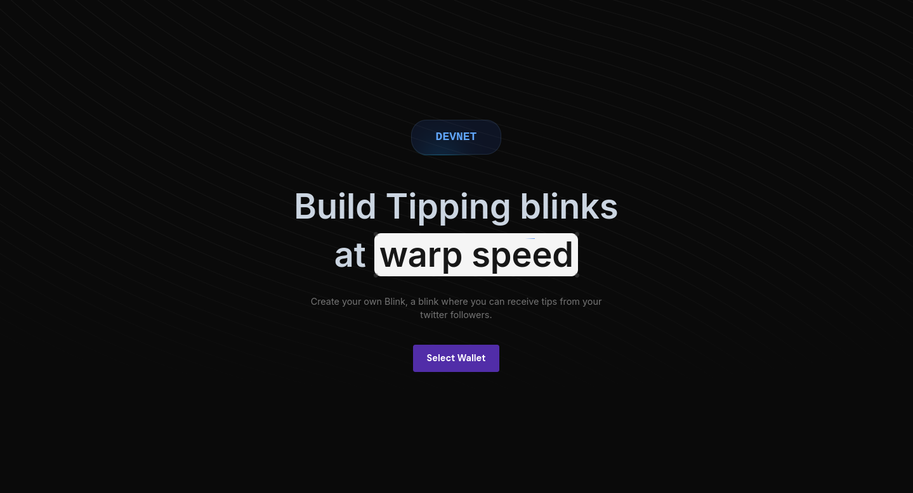

## Getting Started

## Tip-Blink

Tip Blink is an app that allows users to effortlessly create personalized profiles for accepting tips, without any coding required. Users can create accounts based on Twitter usernames, leveraging the Reclaim protocol with zkTLS technology. This ensures that we can effectively filter out users attempting to impersonate famous Twitter handles as their Blink profiles

**Currently we are only on Devnet**



## **Run the development server**:

_Copy the below things and paste it in the .env file and make sure to get db url from the aiven and EDGE_STORE keys from the edgestore.dev and RPC Endpoint from any rpc provider (helius)_

```
DATABASE_URL=""
EDGE_STORE_ACCESS_KEY=""
EDGE_STORE_SECRET_KEY=""
RPC_END_POINT=""
```

```bash
npm run dev
# or
yarn dev
# or
pnpm dev
# or
bun dev
```

Open [http://localhost:3000](http://localhost:3000) with your browser to see the result.
